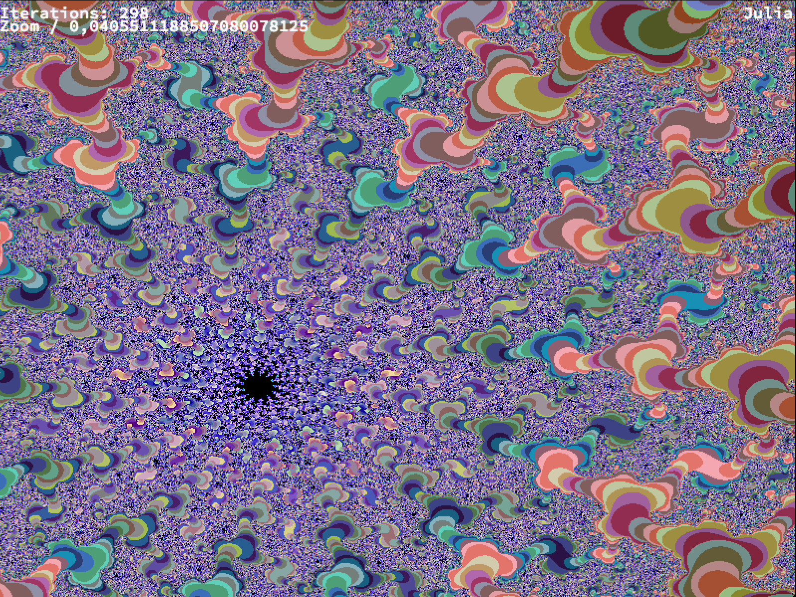

# FRACTOL

This project consists to create a small fractal exploration software

[What is a Fractal ?](https://en.wikipedia.org/wiki/Fractal)

### Installing

Take a look to `Minilibx/README.md` to install `Minilibx`

Clone the project

```
git clone https://github.com/jlange91/Fractol
```

Then execute Makefile to create an executable

```
make re
```

### Running

An executable is available in deposit, if you can't `make` the Makefile

```
chmod u+x fractol
```

Choose a fractal :
* mandelbrot
* julia
* burningship
* mandelbar


```
./fractol [name_fractal]
```

### Events

KEYS | DESCRIPTION
<kbd>ESC</kbd> | Exit the program

<kbd>ARROWS</kbd> | Move map(x,y)

<kbd>1/2/3/4/5/6</kbd> | Other fractal

<kbd>C</kbd> | Color

<kbd>+/-</kbd> | Iteration

<kbd>A</kbd> | Zoom +

<kbd>E</kbd> | Zoom -

<kbd>Mouse right click</kbd> | Only available for Julia

<kbd>Mouse</kbd> | DeepZoom

<kbd>Z</kbd> | Reset

<kbd>R</kbd> | change options only available for mandelbrot and mandelbar

### Example



### Deployment

Develop for UNIX systems

### Built With

* [Minilibx] - The framework for graphical user interface development

